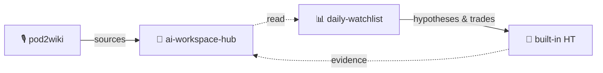

# 奔波儿r / Benbor

**私募研究员 · 不写代码 · 做 AI 投研工具，自己每天在用**
Hedge fund researcher, zero-code. Every AI tool I ship, I use daily.

---

## 🛠️ 零代码 AI 投研三件套 / Zero-code AI investment research toolkit

**输入 → 基座 → 日常 + 决策**，三个工具串成一条闭环。
**Input → substrate → daily loop + decision feedback.** Three tools, one closed loop.

<table>
  <tr>
    <td width="33%" valign="top">
      <h3>🎙️ <a href="https://github.com/Benboerba620/pod2wiki">pod2wiki</a></h3>
      <b>输入 / Input</b>
        
      把高质量播客（YouTube/RSS）自动转成中文摘要 + 英文原文存档。Whisper + DeepSeek，一键 AI 安装。
        
      Podcasts and long-form RSS into Chinese summaries plus archived English transcripts. Whisper + DeepSeek.
        
      
    </td>
    <td width="33%" valign="top">
      <h3>🌱 <a href="https://github.com/Benboerba620/ai-workspace-hub">ai-workspace-hub</a></h3>
      <b>基座 / Substrate</b>
        
      Codex-first、Claude-compatible 的最小 AI 工作基座：<b>输入 → 知识库 → 输出 → 反馈 + 记忆</b>。内置个人 wiki，clone 即跑、零依赖，想要更多就插模块。
        
      A minimal, zero-dependency AI workspace substrate. Codex-first, Claude-compatible — clone and it runs. Ships with a built-in personal wiki.
        
      
    </td>
    <td width="33%" valign="top">
      <h3>📊 <a href="https://github.com/Benboerba620/daily-watchlist">daily-watchlist</a></h3>
      <b>日常 + 决策 / Daily loop + decision</b>
        
      股票池每日 AI 监控，内置假设追踪。<code>/dw-today</code> 写日报，<code>/ht-new</code>、<code>/ht-status</code>、<code>/ht-trade</code> 管理假设和交易证据。
        
      AI-powered stock monitoring with built-in hypothesis tracking for Claude Code.
        
      
    </td>
  </tr>
</table>

---

## 🧠 知识库单品 / Standalone: the knowledge base

**[karpathy-claude-wiki](https://github.com/Benboerba620/karpathy-claude-wiki)** —— Karpathy 风格的个人 wiki 模板，给 LLM 读写。纯 markdown + frontmatter，**刻意不用向量库 / 不做 RAG**。ai-workspace-hub 内置的知识库就是这套；想单独把知识库部分拿去用，直接看它。

A personal wiki template for LLMs — markdown + frontmatter, no vector DB, no RAG. It's the same knowledge layer bundled inside ai-workspace-hub; grab it standalone if that's all you need.

---

## 为什么是零代码 / Why zero-code

投研本来就是知识工作 —— 追踪公司、假设、行业脉络，和追踪文章、概念、自己的认知迭代，需要的是同一套脚手架。我自己就是零代码出身，做出来的工具默认给"和我一样不会写代码"的人用。

English

Investment research *is* knowledge work — tracking companies, hypotheses, and industry threads needs the same scaffolding as tracking articles, concepts, and your own evolving thinking. I have zero coding background myself — every tool I build is designed for people who, like me, can't write a line of Python.

---

## 📬 Where to find me

| 渠道 / Channel | 链接 / Link | 写什么 / What |
|---|---|---|
| 公众号「奔波儿r」 | [代表作一篇](https://mp.weixin.qq.com/s/Ygatb842ew_JeN4LdcAbZg) | 投资行业拆解 + AI 探索 / Industry deep-dives + AI experiments |
| 即刻 (Jike) | [@奔波儿r](https://okjk.co/mTVFAE) | 日常想法和项目更新 / Daily thoughts & project updates |

---

## 🔍 What I'm currently exploring

- 让 0 代码基础的人也能搭建和维护自己的 AI 工作流（投研 / 知识库 / 写作）
- AI 在投资研究里**真正能加速**的环节，vs 只是看起来能加速的环节
- 个人知识库写给 LLM 看，和写给未来的自己看，哪些约定要重新定

---

## 💡 Stay in the loop

新工具上线频率不低，想第一时间知道的话：⭐ star 上面任一仓库收 release 通知，或 **follow 这个 profile**。
New tools drop regularly — ⭐ any repo for release notifications, or **follow this profile** to catch them first.

---

🐱 Profile picture is my cat 豆包. He's the chief approver. / 头像是我家猫豆包，首席审稿人。
